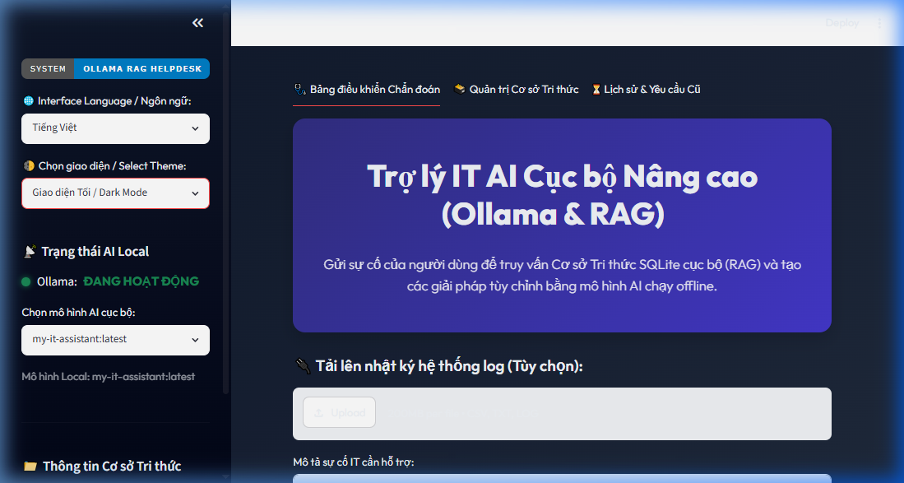
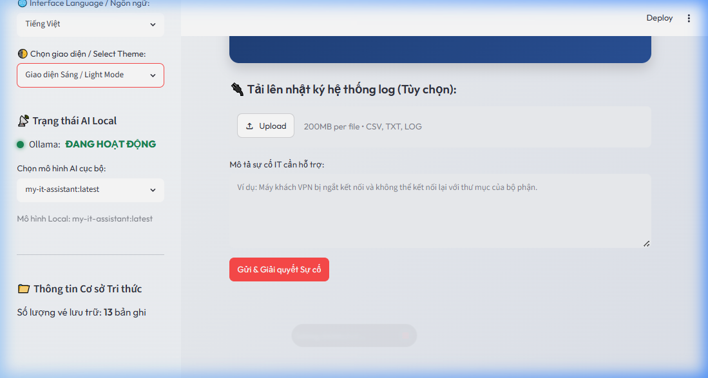
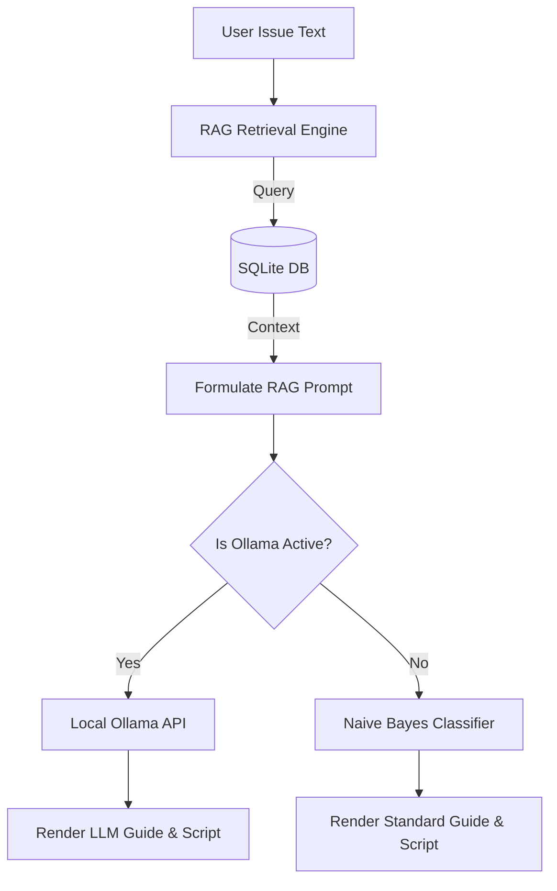

# 🖥️ Trợ lý Hỗ trợ IT AI Cục bộ Nâng cao (Ollama & RAG)

[](https://github.com/TamNguyenmeomeo/10_ai_it_support_assistant/actions/workflows/ci.yml)
[](https://opensource.org/licenses/MIT)
[](https://streamlit.io)

Ứng dụng Web chẩn đoán lỗi và giải quyết sự cố IT ngoại tuyến (offline) cao cấp, được xây dựng bằng **Streamlit**, cơ sở dữ liệu **SQLite** và **Ollama**. Hệ thống triển khai quy trình RAG (Retrieval-Augmented Generation) để tự động truy xuất các sự cố tương tự trong quá khứ từ cơ sở tri thức (1.213 bản ghi) và cấp làm ngữ cảnh cho mô hình ngôn ngữ lớn (LLM) nội bộ chạy trên máy tính của bạn để đưa ra giải pháp và viết script sửa lỗi tùy chỉnh.

---

## 🎨 Xem trước giao diện người dùng

### Giao diện Tối / Dark Mode
Giao diện tối sử dụng nền gradient màu xanh navy và slate thẫm, kết hợp với các thẻ kính mờ (glassmorphism) và văn bản độ tương phản cao tạo nên diện mạo vô cùng hiện đại và chuyên nghiệp:


### Giao diện Sáng / Light Mode
Giao diện sáng sử dụng nền xám slate sáng và văn bản màu tối giúp tối ưu hóa khả năng đọc và sử dụng vào ban ngày:


---

## 🌟 Tính năng chính

*   **Truy xuất thông tin thông minh (RAG):** Quét cơ sở dữ liệu SQLite cục bộ bằng độ tương đồng văn bản TF-IDF để tìm kiếm các sự cố giống lỗi người dùng nhập nhất làm dữ liệu tham khảo cho AI.
*   **Tích hợp LLM nội bộ (Local LLM):** Kết nối trực tiếp với API của **Ollama** đang chạy các dòng mô hình như `my-it-assistant` hoặc `qwen2.5-coder:7b` để viết các đoạn mã script phục hồi hệ thống chính xác.
*   **Hỗ trợ Song ngữ:** Dễ dàng chuyển đổi ngôn ngữ hiển thị giữa Tiếng Anh và Tiếng Việt ngay trên thanh bên.
*   **Thay đổi Theme linh hoạt:** Tùy chọn giao diện Sáng / Tối theo nhu cầu người dùng.
*   **Cơ chế dự phòng an toàn (Fallback):** Nếu dịch vụ Ollama tắt hoặc không hoạt động, ứng dụng sẽ tự động chuyển đổi sang sử dụng bộ phân loại học máy Naive Bayes (chạy offline bằng scikit-learn) để chẩn đoán sơ bộ.

---

## 🏗️ Sơ đồ Kiến trúc Hệ thống



---

## 💻 Hướng dẫn thiết lập và chạy trên máy cá nhân

### Bước 1: Di chuyển tới thư mục dự án và cài đặt thư viện
Mở Terminal/Cmd tại thư mục dự án và chạy:
```bash
pip install -r requirements.txt
```

### Bước 2: Cài đặt và cấu hình LLM cục bộ (Ollama)
1. Tải và cài đặt phần mềm [Ollama](https://ollama.com/) trên Windows.
2. Khởi động Ollama và chạy mô hình của bạn:
   ```bash
   ollama run my-it-assistant
   ```

### Bước 3: Khởi chạy ứng dụng Web
Chạy lệnh khởi tạo giao diện:
```bash
streamlit run app.py
```
Mở trình duyệt tại địa chỉ `http://localhost:8501`.

---

## 🧪 Chạy Kiểm thử tự động (Unit Tests)
Để xác minh tính toàn vẹn của cơ sở dữ liệu và công cụ so khớp RAG, hãy chạy lệnh sau:
```bash
python -m unittest tests/test_app.py
```

---

## 📄 Bản quyền
Dự án được cấp phép theo Giấy phép MIT - xem tệp [LICENSE](LICENSE) để biết thêm chi tiết.
